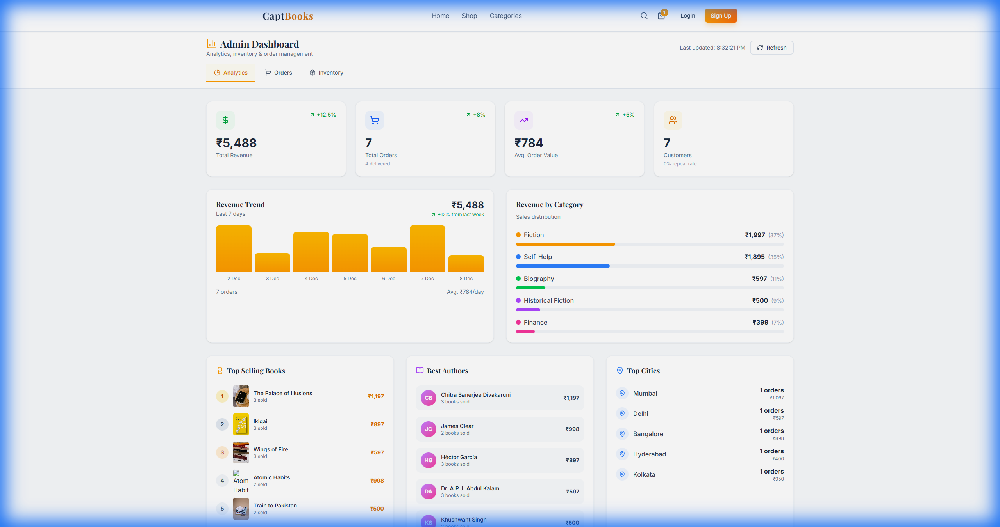
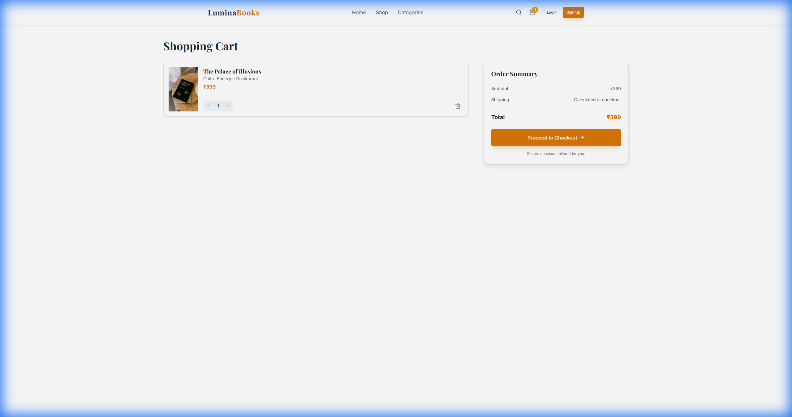

# 📚 CaptBooks - Premium Indian Online Bookstore

A modern, feature-rich online bookstore built for the Indian market with React, Tailwind CSS, and Firebase. Features advanced animations, comprehensive analytics dashboard, and full e-commerce functionality.


## ✨ Features

### 🛒 E-Commerce Functionality
- **Product Catalog** - Browse books with filtering by category and price
- **Shopping Cart** - Add/remove items with persistent storage
- **Checkout Flow** - Multi-step checkout with shipping and payment forms
- **Order Management** - Track orders from pending to delivery

### 📊 Admin Dashboard & Analytics
- **Revenue Analytics** - Track daily/weekly sales trends
- **Top Selling Books** - See your bestsellers ranked by sales
- **Category Insights** - Revenue breakdown by book category
- **Customer Analytics** - Top customers, repeat rate, geographic distribution
- **Inventory Management** - Monitor stock levels with low-stock alerts
- **Order Management** - Update order status, view order details



### 🎨 Premium UI/UX
- **Light Theme** - Clean, modern design with warm amber accents
- **Advanced Animations** - Powered by Framer Motion
  - Floating book elements in hero section
  - 3D tilt effect on book cards
  - Page transitions with smooth fade/slide
  - Staggered entrance animations
- **Responsive Design** - Works on all device sizes
- **Toast Notifications** - Feedback for cart actions

### 🇮🇳 Indian Market Localization
- **INR Currency (₹)** - All prices in Indian Rupees
- **Indian Authors** - Featured collection of Indian literature
- **Local Book Content** - Curated selection of Indian books

## 📸 Screenshots

### Shop Page


### Cart Page


## 🛠️ Tech Stack

| Technology | Purpose |
|------------|---------|
| **React 18** | Frontend framework |
| **Vite** | Build tool & dev server |
| **Tailwind CSS v4** | Styling with custom design system |
| **Framer Motion** | Animations & transitions |
| **Firebase** | Authentication & Firestore database |
| **React Router v6** | Client-side routing |
| **Lucide React** | Beautiful icons |

## 🚀 Getting Started

### Prerequisites
- Node.js 18+ 
- npm or yarn

### Installation

1. **Clone the repository**
   ```bash
   git clone https://github.com/captflag/Online-Book-Store.git
   cd Online-Book-Store
   ```

2. **Install dependencies**
   ```bash
   npm install
   ```

3. **Set up Firebase (Optional)**
   
   Create a `.env` file in the root directory:
   ```env
   VITE_FIREBASE_API_KEY=your_api_key
   VITE_FIREBASE_AUTH_DOMAIN=your_project.firebaseapp.com
   VITE_FIREBASE_PROJECT_ID=your_project_id
   VITE_FIREBASE_STORAGE_BUCKET=your_project.appspot.com
   VITE_FIREBASE_MESSAGING_SENDER_ID=your_sender_id
   VITE_FIREBASE_APP_ID=your_app_id
   ```
   
   > **Note:** The app works in demo mode without Firebase credentials!

4. **Start the development server**
   ```bash
   npm run dev
   ```

5. **Open in browser**
   ```
   http://localhost:5173
   ```

## 📁 Project Structure

```
src/
├── components/
│   ├── home/
│   │   ├── Hero.jsx          # Animated hero section
│   │   ├── FeaturedBooks.jsx # Carousel of featured books
│   │   └── TopWriters.jsx    # Indian authors showcase
│   ├── shop/
│   │   └── Filters.jsx       # Category & price filters
│   ├── ui/
│   │   ├── BookCard.jsx      # 3D animated book card
│   │   └── Button.jsx        # Reusable button component
│   ├── Navbar.jsx            # Navigation with cart indicator
│   ├── Footer.jsx            # Site footer
│   └── Layout.jsx            # Page layout with transitions
├── context/
│   ├── AuthContext.jsx       # Firebase authentication
│   ├── CartContext.jsx       # Shopping cart state
│   └── ToastContext.jsx      # Toast notifications
├── lib/
│   ├── books.js              # Book CRUD & inventory
│   ├── orders.js             # Orders & analytics
│   ├── firebase.js           # Firebase initialization
│   └── utils.js              # Utility functions
├── pages/
│   ├── Home.jsx              # Landing page
│   ├── Shop.jsx              # Product listing
│   ├── BookDetails.jsx       # Single book view
│   ├── Cart.jsx              # Shopping cart
│   ├── Checkout.jsx          # Checkout flow
│   ├── Login.jsx             # User login
│   ├── Signup.jsx            # User registration
│   ├── Profile.jsx           # User profile
│   ├── AdminDashboard.jsx    # Admin analytics & management
│   └── OrderSuccess.jsx      # Order confirmation
└── index.css                 # Tailwind & custom styles
```

## 🔥 Firebase Integration

### Database Schema

**Books Collection**
```javascript
{
  title: string,
  author: string,
  price: number,
  originalPrice: number,
  category: string,
  rating: number,
  stock: number,
  cover: string,
  description: string,
  createdAt: timestamp,
  updatedAt: timestamp
}
```

**Orders Collection**
```javascript
{
  items: [{ bookId, title, author, price, quantity, cover }],
  customer: { name, email, address, city, zip },
  subtotal: number,
  shipping: number,
  total: number,
  status: 'pending' | 'confirmed' | 'shipped' | 'delivered',
  createdAt: timestamp
}
```

## 📊 Analytics Features

| Feature | Description |
|---------|-------------|
| Revenue Trend | 7-day bar chart of daily revenue |
| Top Selling Books | Ranked list with sales count |
| Category Breakdown | Revenue distribution by category |
| Top Authors | Best performing authors by revenue |
| Geographic Data | Orders by city |
| Customer Insights | Repeat rate, top customers |
| Stock Alerts | Low inventory warnings |

## 🎯 Routes

| Path | Description |
|------|-------------|
| `/` | Home page |
| `/shop` | Product catalog |
| `/book/:id` | Book details |
| `/cart` | Shopping cart |
| `/checkout` | Checkout process |
| `/login` | User login |
| `/signup` | User registration |
| `/profile` | User profile |
| `/admin` | Admin dashboard |

## 🤝 Contributing

1. Fork the repository
2. Create your feature branch (`git checkout -b feature/AmazingFeature`)
3. Commit your changes (`git commit -m 'Add some AmazingFeature'`)
4. Push to the branch (`git push origin feature/AmazingFeature`)
5. Open a Pull Request

## 📄 License

This project is licensed under the MIT License.

## 👨‍💻 Author

**CaptFlag**
- GitHub: [@captflag](https://github.com/captflag)

---

<p align="center">
  <b>Made with ❤️ for Indian Readers</b>
</p>
