# CaptBooks - Technical Documentation

## 📋 Table of Contents
1. [Technology Stack](#technology-stack)
2. [Architecture Overview](#architecture-overview)
3. [Data Flow](#data-flow)
4. [Component Architecture](#component-architecture)
5. [Database Design](#database-design)
6. [Authentication Flow](#authentication-flow)
7. [Order Processing Flow](#order-processing-flow)
8. [Analytics System](#analytics-system)

---

## 🛠️ Technology Stack

### Frontend Framework

| Technology | Version | Why We Used It |
|------------|---------|----------------|
| **React 18** | 18.3.1 | Industry-standard UI library with excellent component-based architecture, virtual DOM for performance, and massive ecosystem of tools and libraries. React's hooks API enables clean, functional components. |
| **Vite** | 6.0.1 | Lightning-fast build tool with Hot Module Replacement (HMR). Vite provides instant development server startup and faster builds compared to webpack, improving developer experience significantly. |

### Styling & Design

| Technology | Version | Why We Used It |
|------------|---------|----------------|
| **Tailwind CSS** | 4.0.0 | Utility-first CSS framework enabling rapid UI development without context-switching. Tailwind v4 provides CSS-native configuration with `@theme` for better performance and smaller bundle sizes. |
| **Framer Motion** | 11.x | Production-ready animation library for React, enabling complex animations with simple declarative syntax. Provides gesture support and layout animations out of the box. |

### Backend & Database

| Technology | Version | Why We Used It |
|------------|---------|----------------|
| **Firebase Auth** | 11.x | Secure, drop-in authentication with support for multiple providers (email/password, Google, etc.). Eliminates need to build custom auth from scratch. |
| **Cloud Firestore** | 11.x | NoSQL document database with real-time sync, offline support, and automatic scaling. Perfect for e-commerce with flexible schema for products, orders, and users. |

### Utilities

| Technology | Purpose | Why We Used It |
|------------|---------|----------------|
| **React Router v6** | Navigation | Declarative routing with nested routes, dynamic params, and built-in loading states. |
| **Lucide React** | Icons | Modern, consistent icon set with tree-shaking support for smaller bundles. |
| **clsx + tailwind-merge** | Class Management | Conditional class handling and intelligent Tailwind class merging for component variants. |

---

## 🏗️ Architecture Overview

```mermaid
flowchart TB
    subgraph Client["🌐 CLIENT (Browser)"]
        subgraph UI["UI Layer"]
            React["⚛️ React Components"]
            Framer["🎬 Framer Motion"]
            Tailwind["🎨 Tailwind CSS"]
            Router["🔀 React Router"]
        end
        
        subgraph Context["Context Providers"]
            Auth["AuthContext"]
            Cart["CartContext"]
            Toast["ToastContext"]
        end
        
        subgraph Services["Service Layer (lib/)"]
            BooksJS["books.js"]
            OrdersJS["orders.js"]
            FirebaseJS["firebase.js"]
        end
    end
    
    subgraph Firebase["☁️ FIREBASE CLOUD"]
        FireAuth["🔐 Firebase Auth\n• Email/Password\n• Google Sign-In"]
        Firestore["🗄️ Cloud Firestore\n• books collection\n• orders collection\n• users collection"]
    end
    
    UI --> Context
    Context --> Services
    Services -->|HTTPS| Firebase

    style Client fill:#f0f9ff,stroke:#0ea5e9
    style Firebase fill:#fff7ed,stroke:#f97316
    style UI fill:#fdf4ff,stroke:#d946ef
    style Context fill:#f0fdf4,stroke:#22c55e
    style Services fill:#fefce8,stroke:#eab308
```

---

## 🔄 Data Flow

### User Shopping Flow

### State Management Flow

```mermaid
flowchart TB
    subgraph Components["React Components"]
        Home["🏠 Home"]
        Shop["🛍️ Shop"]
        BookDetail["📚 BookDetail"]
        Cart["🛒 Cart"]
        Admin["📊 Admin"]
    end
    
    subgraph Contexts["Context Layer"]
        AuthCtx["AuthContext\n• user\n• loading\n• login()\n• logout()"]
        CartCtx["CartContext\n• cart[]\n• addToCart()\n• removeItem()\n• clearCart()"]
        ToastCtx["ToastContext\n• success()\n• error()\n• info()"]
    end
    
    subgraph Services["Service Layer"]
        Books["books.js → Firestore"]
        Orders["orders.js → Firestore"]
        FB["firebase.js → Firebase SDK"]
    end
    
    Components --> Contexts
    Contexts --> Services

    style Components fill:#ede9fe,stroke:#8b5cf6
    style Contexts fill:#dcfce7,stroke:#22c55e
    style Services fill:#fef3c7,stroke:#f59e0b
```

---

## 🧩 Component Architecture

```mermaid
flowchart TB
    App["App.jsx"]
    
    App --> AuthP["AuthProvider"]
    AuthP --> CartP["CartProvider"]
    CartP --> ToastP["ToastProvider"]
    ToastP --> BRouter["BrowserRouter"]
    
    BRouter --> Layout["Layout.jsx\n(page transitions)"]
    
    Layout --> Navbar["Navbar.jsx\n• Logo\n• Nav Links\n• Cart Badge"]
    Layout --> Routes["Routes"]
    Layout --> Footer["Footer.jsx"]
    
    Routes --> Home["Home.jsx"]
    Routes --> Shop["Shop.jsx"]
    Routes --> BookDetails["BookDetails.jsx"]
    Routes --> CartPage["Cart.jsx"]
    Routes --> Checkout["Checkout.jsx"]
    Routes --> Admin["AdminDashboard.jsx"]
    
    Home --> Hero["Hero.jsx\n(floating animations)"]
    Home --> Featured["FeaturedBooks.jsx\n(carousel)"]
    Home --> Writers["TopWriters.jsx\n(gradient rings)"]
    
    Shop --> Filters["Filters.jsx"]
    Shop --> BookCards["BookCard.jsx[]\n(3D tilt)"]
    
    Admin --> Analytics["Analytics Tab\n• StatCards\n• BarChart\n• TopBooks"]
    Admin --> OrdersTab["Orders Tab"]
    Admin --> Inventory["Inventory Tab"]

    style App fill:#fef3c7,stroke:#f59e0b
    style Layout fill:#dbeafe,stroke:#3b82f6
    style Admin fill:#dcfce7,stroke:#22c55e
```

---

## 🗄️ Database Design

### Firestore Collections Schema

### Order Status Flow

---

## 🔐 Authentication Flow

```mermaid
flowchart TD
    Start["👤 User Opens App"] --> Check{"AuthContext\nCheck Session"}
    
    Check -->|User Exists| LoggedIn["✅ Load Profile\nShow Full App"]
    Check -->|No User| Guest["Show Login Button"]
    
    Guest --> Choice{"Login Method"}
    
    Choice -->|Email/Password| EmailAuth["signInWithEmail\nAndPassword()"]
    Choice -->|Google| GoogleAuth["signInWithPopup()\nGoogleProvider"]
    
    EmailAuth --> Firebase["🔐 Firebase Auth"]
    GoogleAuth --> Firebase
    
    Firebase -->|Success| Session["Set User Session\nUpdate AuthContext"]
    Firebase -->|Error| Error["Show Error\nToast Notification"]
    
    Session --> LoggedIn
    Error --> Guest

    style Start fill:#dbeafe,stroke:#3b82f6
    style LoggedIn fill:#dcfce7,stroke:#22c55e
    style Firebase fill:#fef3c7,stroke:#f59e0b
    style Error fill:#fee2e2,stroke:#ef4444
```

---

## 📦 Order Processing Flow

---

## 📊 Analytics System

### Analytics Data Flow

```mermaid
flowchart LR
    subgraph Sources["📥 Data Sources"]
        Orders["orders\ncollection"]
        Books["books\ncollection"]
        Customers["customer data\n(from orders)"]
    end
    
    subgraph Processing["⚙️ Analytics Functions"]
        Stats["getSalesStats()"]
        TopBooks["getTopSellingBooks()"]
        Category["getRevenueByCategory()"]
        Daily["getSalesByDay()"]
        Authors["getTopAuthors()"]
        Cities["getOrdersByCity()"]
        Insights["getCustomerInsights()"]
    end
    
    subgraph Output["📊 Dashboard Components"]
        StatCards["Stat Cards"]
        BarChart["Revenue Chart"]
        Tables["Data Tables"]
        Lists["Ranking Lists"]
    end
    
    Sources --> Processing
    Processing --> Output

    style Sources fill:#dbeafe,stroke:#3b82f6
    style Processing fill:#fef3c7,stroke:#f59e0b
    style Output fill:#dcfce7,stroke:#22c55e
```

### Analytics Functions Reference

| Function | Data Source | Output | Purpose |
|----------|-------------|--------|---------|
| `getSalesStats()` | orders | totals, counts | Overall business metrics |
| `getTopSellingBooks()` | orders.items | ranked books | Identify bestsellers |
| `getRevenueByCategory()` | orders.items | category breakdown | Category performance |
| `getSalesByDay()` | orders | daily totals | Trend visualization |
| `getTopAuthors()` | orders.items | author rankings | Author performance |
| `getOrdersByCity()` | orders.customer | city distribution | Geographic insights |
| `getCustomerInsights()` | orders.customer | customer metrics | Loyalty analysis |

---

## 🖼️ Application Screenshots

### Home Page

*Premium hero section with floating book animations and featured collection*

### Shop Page

*Product catalog with category filters and 3D animated book cards*

### Cart Page

*Shopping cart with order summary and checkout button*

### Analytics Dashboard

*Comprehensive analytics with revenue trends, top products, and customer insights*

---

## 🚀 Performance Considerations

| Optimization | Implementation |
|--------------|----------------|
| **Code Splitting** | React.lazy() for route components |
| **Image Optimization** | External CDN URLs (Unsplash) |
| **Bundle Size** | Vite tree-shaking, minimal dependencies |
| **State Management** | React Context (no Redux overhead) |
| **CSS** | Tailwind purging unused classes |
| **Database** | Firestore caching & offline support |

---

## 📝 Future Enhancements

- [ ] Server-side rendering with Next.js
- [ ] Payment gateway integration (Razorpay/Stripe)
- [ ] Email notifications for order updates
- [ ] Wishlist functionality
- [ ] Book reviews and ratings
- [ ] Search with Algolia/Elasticsearch
- [ ] PWA support for mobile

---

  <b>Documentation by CaptFlag</b> 
  <i>Last Updated: December 2024</i>

